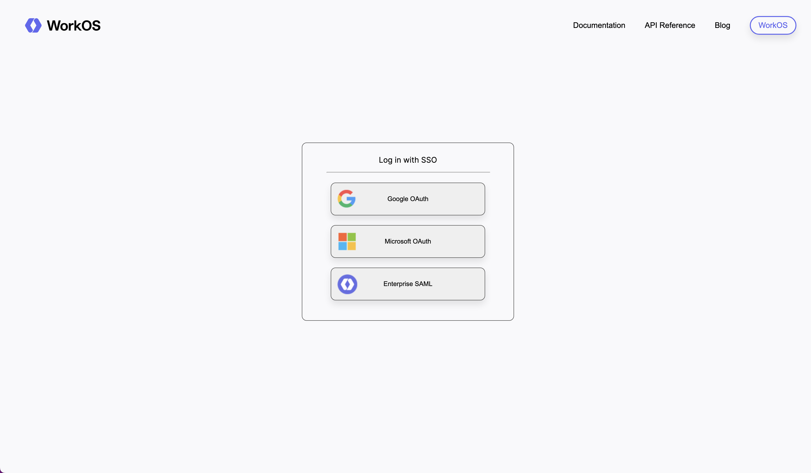
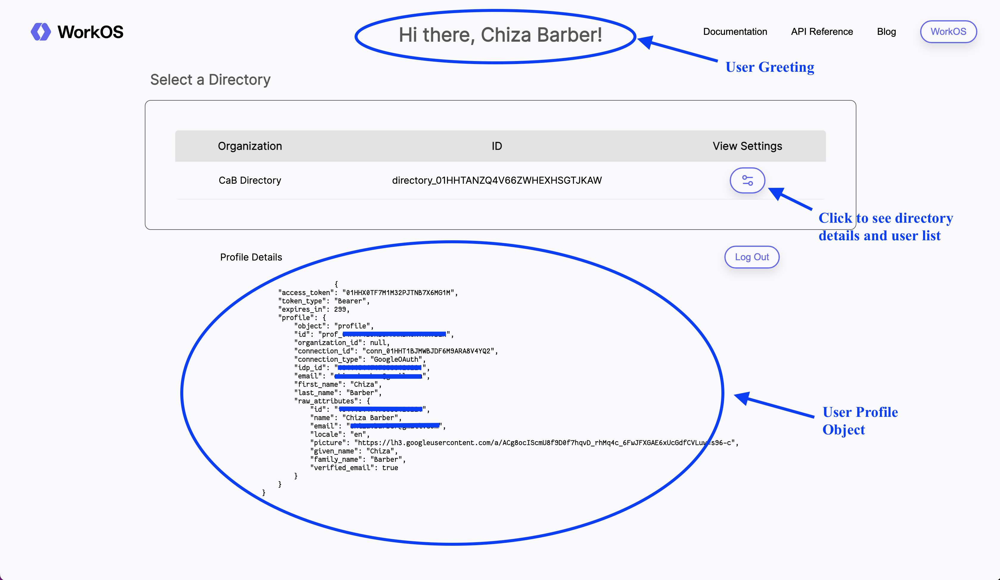
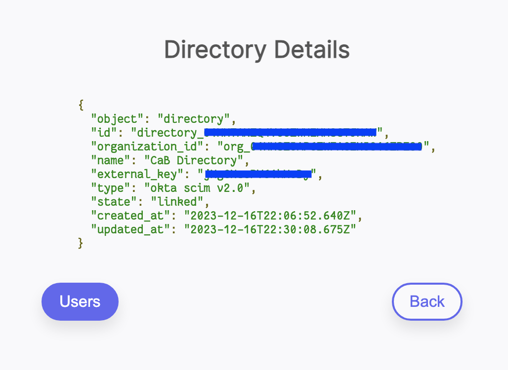
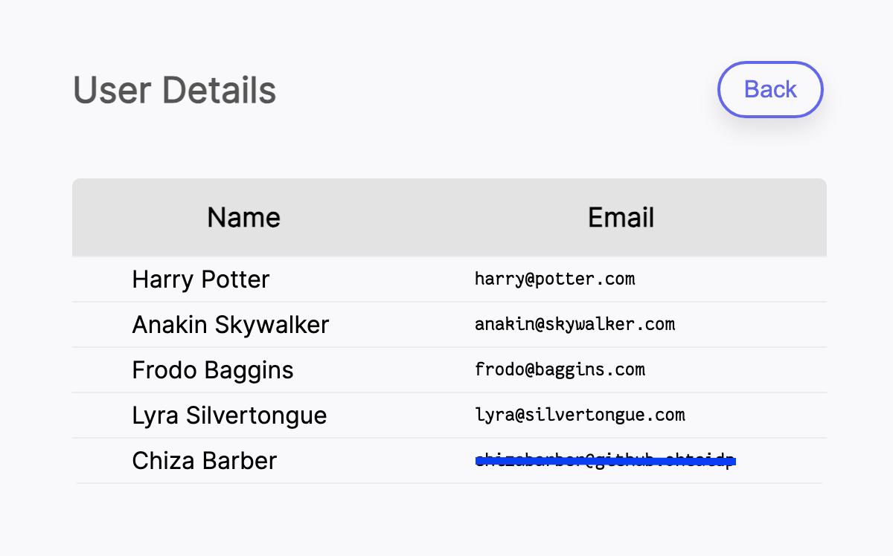

# Node.js Example App with SSO and Directory Sync powered by WorkOS

An example application demonstrating how to use the [WorkOS Node.js SDK](https://github.com/workos/workos-node) to authenticate users via SSO and power Directory Sync.

## Access the deployed app

<a href="https://workos.onrender.com target="_blank">Example App with SSO and Directory Sync on Render</a>

### Login with SSO

Choose from the following options:
- Google OAuth
- Microsoft OAuth
- Enterprise SAML



### Successful Login

Upon logging in successfully, you will see the User Greeting dynamically rendered from the user profile data. Click the View Settings icon to see the Directory details and User list.



### Directory and Users




## Running the app locally

### Prerequisites

- Node.js version 10+
- A WorkOS Dashboard account
- An Okta Developer account

### Node.js Project Setup

1. Clone the main repo:

    ```bash
    # HTTPS
    git clone https://github.com/chizabarber/workos.git
    ```

    or

    ```bash
    # SSH
    git clone git@github.com:chizabarber/workos.git
    ```

2. Install the dependencies.
    ```bash
    npm install
    ```
  
### Configure your environment

3. Grab your API Key and Client ID from your WorkOS Dashboard. Also grab your Org ID from WorkOS Dashboard > Organizations > Organization details. 

Create a `.env` file at the project root, and store them like so:

    ```
    WORKOS_API_KEY=sk_xxxxxxxxxxxxx
    WORKOS_CLIENT_ID=project_xxxxxxxxxxxx
    WORKOS_ORG_ID=org_xxxxxxxxxxxx
    ```

### SSO and Directory Sync Setup with WorkOS

4. Follow the [SSO Quick Start Guide](https://workos.com/docs/sso/guide/introduction) to create a new SSO connection in your WorkOS dashboard.

5. Follow the [Directory Sync Quick Start Guide](https://workos.com/docs/directory-sync/quick-start/1-create-a-new-directory-connection) to create a new Directory connection in your WorkOS dashboard.

6. Add `http://localhost:8000/callback` as a Redirect URI in the Developer > Redirects section of the WorkOS Dashboard.

### Testing the Integration

7. Start the server and head to http://localhost:8000/ to begin the login flow and navigate your directories:

```sh
npm start
```